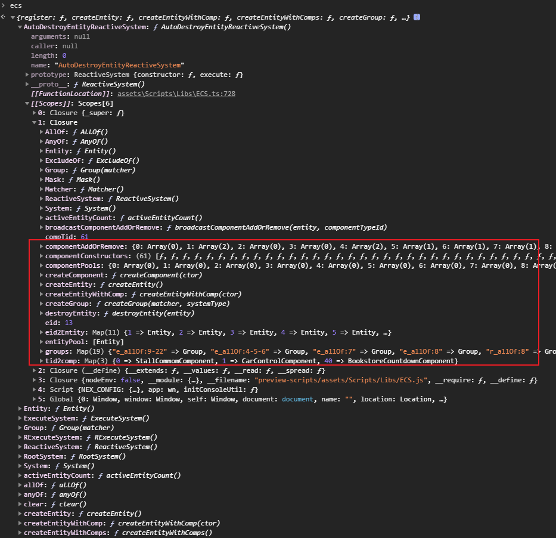

# 简介
这是一个Typescript语言版的Entity-Component-System框架。框架参考了Unity的[Entitas](https://github.com/sschmid/Entitas-CSharp)框架。

# 使用说明
## 组件
组件必须实现ecs.IComponent，并且需要使用ecs.register注册组件。
```
@ecs.register('Hello')
export class HelloComponent implements ecs.IComponent {
    data: number;
}
```
ecs.register组件填入的参数是方便通过```entity.Hello```获得组件对象。ecs.register还会将组件的构造函数存入```ecs.Context```中，并且给该类组件分配一个组件id。

## 实体
为了能利用Typescript的类型提示机制，在使用实体的时候需要用户自己继承ecs.Entity。
```
class AEntity extends ecs.Entity {
    Hello: HelloComponent; // 这里的Hello要和ecs.register中填入的参数一致
}

export EntityX extends AEntity {

}
```

添加组件：
```
entity.add(HelloComponent); // 添加组件时会优先从组件缓存池中获取无用的组件对象，如果没有才会新创建一个组件对象
```

删除组件：
```
entity.remove(HelloComponent); // 组件对象会从实体身上移除并放入组件缓存池中
```

获得组件对象：
```
1、entity.Hello; // 见上方自定义实体操作

2、entity.get(HelloComponent);
```

判断是否拥有组件：
```
1、entity.has(HelloComponent);

2、!!entity.Hello;
```

销毁实体：
```
entity.destroy() // 销毁实体时会先删除实体身上的所有组件，然后将实体放入实体缓存池中
```

## 实体筛选
目前提供了四种类型的筛选能力，但是这四种筛选能力可以组合从而提供更强大的筛选功能。
- anyOf: 用来描述包含任意一个这些组件的实体；
- allOf: 用来描述同时包含了这些组件的实体；
- onlyOf: 用来描述只包含了这些组件的实体；不是特殊情况不建议使用onlyOf，因为onlyOf会监听所有组件的添加和删除事件；
- excludeOf: 表示不包含所有这里面的组件（“与”关系）；

使用方式：
```
ecs.allOf(HelloComponent);
ecs.onlyOf(HelloComponent);
```

## 系统
- ecs.System: 用来组合某一功能所包含的系统；
- ecs.RootSystem: 系统的root；
- ecs.ReactiveSystem: 如果捕获到组件则只会执行一次；
- ecs.ExecuteSystem: 如果捕获到组件则每帧都会执行；
- ecs.RExecuteSystem: 如果捕获到组件，能监听组件第一次进入，并且每帧都会执行；
- ecs.AutoDestroyEntityReactiveSystem：会自动销毁实体；

# 怎么使用
1、声明组件
```
@ecs.register('Node')
export class NodeComponent implements ecs.IComponent {
    val: cc.Node = null;
}

@ecs.reigster('Velocity')
export class VelocityComponent implements ecs.IComponent {
    heading: cc.Vec2 = cc.v2();
    length: number = 0;
}

@ecs.register('Jump')
export class JumpComponent implements ecs.IComponent {
    height: number = 10;
}
```

2、创建系统
```
export class RoomSystem extends ecs.RootSystem {
    constructor() {
        super();
        this.add(new MoveSystem());
        this.add(new JumpSystem());
    }
}

export class MoveSystem extends ecs.RExecuteSystem {

    filter(): ecs.Matcher {
        return ecs.allOf(NodeComponent, VelocityComponent);
    }

    // 实体第一次进入MoveSystem会进入此方法
    entityEnter(entities: ecs.Entity[]) {
        for(e of entities) {
            e.get(VelocityComponent).length = 20;
        }
    }
    // 每帧都会更新
    update(entities: ecs.Entity[]) {
        for(let e of entities) {
            let moveComp = e.get(MoveComponent);
            lel node = e.get(NodeComponent).val;

            let dtS = moveComp.heading.mul(moveComp.length * this.dt);
            this.node.x += dtS.x;
            this.node.y += dtS.y;
        }
    }
}

export class JumpSystem extends ecs.AutoDestroyEntityReactiveSystem {
    filter(): ecs.Matcher {
        return ecs.allOf(NodeComponent, JumpComponent);
    }
    // 执行一次后，所有实体会自动被回收
    update(entities: ecs.Entity[]) {
        for(let e of entities) {
            ...
        }
    }
}
```

3、驱动ecs框架
```
const { ccclass, property } = cc._decorator;
@ccclass
export class GameControllerBehaviour extends cc.Component {
    @property
    isDebugEcs: boolean = true;

    rootSystem: RootSystem = null;

    onLoad() {
        this.rootSystem = new RootSystem();
        this.rootSystem.init();

        if(this.isDebugEcs) {
            this.rootSystem.initDebug();
        }
    }

    update(dt: number) {
        if(this.isDebugEcs) {
            this.rootSystem.debugExecute(dt);
        }
        else {
            this.rootSystem.execute(dt);
        }
    }
}

```

# 调试
添加如下代码
```
windows['ecs'] = ecs;
```
在chrome浏览器的console中输入ecs可看到

其中红框内为ecs上下文数据。


# Samples
https://github.com/shangdibaozi/ecs_start
